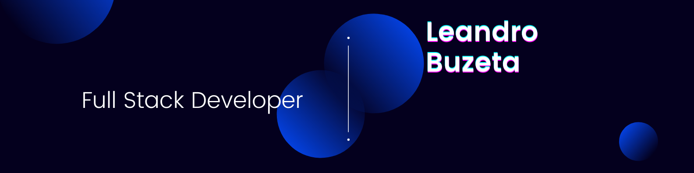

# **Hi there!**

Full Stack Developer with creative skills capable of delivering high results and achieving timely deadlines. The ways to find meaning in my work-life balance are Software Development & Entrepreneurship. The main goal is always the same: To build excellent products and user experiences seeking to add value, impact and of course have fun.

I am a musician ( guitar player ), entrepreneur, full stack developer (in construction). My passion is to create valuable things for the community, that's the why of my learning.

Superjonic (superjonico in spanish): it's a concept created by me, it's about compose music overlaping differents ionan scales, the tones and sounds as a result are very interesting.

# STACK
Javascript | React  React Native | CSS | Material UI | Redux | Node | Express | Sequelize | PostgreSQL | HTML5

<table>
    <tr>
      <td>   </td>
      <td>   </td>
      <td>   </td>
      <td>   </td>
      <td>   </td>
      <td>   </td>
      <td>   </td>
    </tr>
</table>